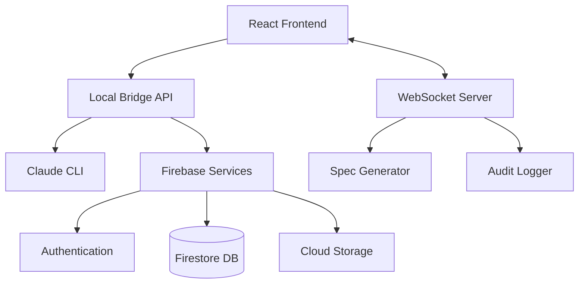

# Agent Manager - Development Guide

## Overview

Agent Manager is a full-stack TypeScript application with advanced features including spec-driven development, real-time collaboration, and comprehensive security. This guide covers the complete development workflow, testing strategies, and best practices.

## Quick Start

### Prerequisites
- Node.js 18+ (tested with v24.4.1)
- pnpm 8+ (recommended) or npm/yarn
- Git
- Claude CLI installed locally
- Firebase project setup
- GitHub OAuth app configured

### Automated Setup
```bash
# Clone repository
git clone https://github.com/yourusername/agent-manager.git
cd agent-manager

# Run automated setup script
./scripts/setup-env.sh

# Start development servers
./scripts/start-dev.sh

# Open application
open http://localhost:5173
```

## Package Manager

This project supports multiple package managers, but **pnpm** is recommended for better performance and disk space efficiency.

### Using pnpm (Recommended)

#### Installation
```bash
# Install pnpm globally
npm install -g pnpm

# Install all dependencies
pnpm install
```

#### Common Commands
```bash
# Start development servers (both frontend and backend)
pnpm dev

# Start specific services
pnpm dev:frontend    # Frontend only
pnpm dev:bridge      # Local bridge only

# Build all packages
pnpm build

# Run linters
pnpm lint

# Clean all build artifacts and node_modules
pnpm clean

# Run tests
pnpm test
```

### Using npm

If you prefer using npm:

```bash
# Install dependencies separately
cd frontend && npm install
cd ../local-bridge && npm install

# Run development servers in separate terminals
# Terminal 1
cd frontend && npm run dev

# Terminal 2
cd local-bridge && npm run dev
```

### Using yarn

If you prefer using yarn:

```bash
# Install dependencies separately
cd frontend && yarn
cd ../local-bridge && yarn

# Run development servers in separate terminals
# Terminal 1
cd frontend && yarn dev

# Terminal 2
cd local-bridge && yarn dev
```

## Workspace Structure

The project uses a monorepo structure with the following packages:

```
agent-manager/
├── frontend/         # React application
├── local-bridge/     # Node.js bridge server
├── package.json      # Root package.json with workspace scripts
├── pnpm-workspace.yaml # pnpm workspace configuration
└── .npmrc           # pnpm configuration
```

## Benefits of pnpm

1. **Disk Space Efficiency**: pnpm uses a content-addressable store, saving disk space by sharing dependencies
2. **Faster Installations**: Dependencies are linked from a global store
3. **Strict Dependency Resolution**: Prevents phantom dependencies
4. **Monorepo Support**: Built-in workspace support

## Architecture Overview

### System Components


### Technology Stack

#### Frontend
- **Framework**: React 18 with TypeScript
- **Build Tool**: Vite (fast development & optimized builds)
- **UI Library**: Tailwind CSS for styling
- **Editor**: Monaco Editor for code editing
- **State Management**: React Context + Custom hooks
- **Real-time**: Socket.io client
- **Testing**: Vitest + React Testing Library
- **Validation**: Zod schemas

#### Backend
- **Runtime**: Node.js 18+ with TypeScript
- **Framework**: Express.js
- **Real-time**: Socket.io server
- **Database**: Firebase Firestore
- **Authentication**: Firebase Auth + JWT
- **File Storage**: Firebase Storage
- **Validation**: Zod schemas
- **Testing**: Vitest
- **Security**: Helmet, CORS, rate limiting

#### New Features (2025-08-10)
- **Spec Generation**: Kiro-style development methodology
- **EARS Notation**: Structured requirements processing
- **Audit Logging**: Comprehensive event tracking
- **Advanced Security**: OWASP Top 10 compliance
- **Mobile Optimization**: Touch gestures, responsive design

## Environment Setup

### Frontend (.env)
```env
# Firebase Configuration
VITE_FIREBASE_API_KEY=your_api_key
VITE_FIREBASE_AUTH_DOMAIN=your_auth_domain
VITE_FIREBASE_PROJECT_ID=your_project_id
VITE_FIREBASE_STORAGE_BUCKET=your_storage_bucket
VITE_FIREBASE_MESSAGING_SENDER_ID=your_sender_id
VITE_FIREBASE_APP_ID=your_app_id

# API Configuration
VITE_LOCAL_BRIDGE_URL=http://localhost:8080

# Development Settings
VITE_APP_ENV=development
VITE_ENABLE_DEVTOOLS=true
VITE_LOG_LEVEL=debug

# Feature Flags (NEW!)
VITE_ENABLE_SPEC_GENERATION=true
VITE_ENABLE_AUDIT_LOGS=true
VITE_ENABLE_MOBILE_FEATURES=true
```

### Local Bridge (.env)
```env
# Server Configuration
NODE_ENV=development
PORT=8080
CORS_ORIGIN=http://localhost:5173

# Firebase Configuration
FIREBASE_PROJECT_ID=your_project_id
FIREBASE_SERVICE_ACCOUNT=./serviceAccount.json

# Claude Configuration
CLAUDE_CLI_PATH=claude
CLAUDE_TIMEOUT=300000

# Security Settings
RATE_LIMIT_WINDOW_MS=900000
RATE_LIMIT_MAX_REQUESTS=100
JWT_SECRET=your-development-secret

# Logging
LOG_LEVEL=debug
LOG_FORMAT=pretty
AUDIT_LOG_ENABLED=true

# Development Settings
HOT_RELOAD=true
DEBUG=agent-manager:*
```

## Development Workflow

### 1. Setup Phase
```bash
# Clone and install
git clone https://github.com/yourusername/agent-manager.git
cd agent-manager
pnpm install

# Environment setup
cp frontend/.env.example frontend/.env
cp local-bridge/.env.example local-bridge/.env
# Edit .env files with your configuration

# Firebase setup (one-time)
./scripts/setup-firebase.sh
```

### 2. Development Phase
```bash
# Start all services
pnpm dev

# Or start individually
pnpm dev:frontend    # React dev server (port 5173)
pnpm dev:bridge      # Node.js server (port 8080)
pnpm dev:test        # Test runner in watch mode
```

### 3. Testing Phase
```bash
# Run all tests
pnpm test

# Run specific test suites
pnpm test:unit       # Unit tests only
pnpm test:integration # Integration tests
pnpm test:e2e        # End-to-end tests (Playwright)

# Test coverage
pnpm test:coverage

# Test with specific patterns
pnpm test -- --grep "spec generation"
```

### 4. Code Quality
```bash
# Linting
pnpm lint            # Check all files
pnpm lint:fix        # Auto-fix issues

# Type checking
pnpm type-check      # TypeScript validation

# Formatting
pnpm format          # Prettier formatting
pnpm format:check    # Check formatting
```

### 5. Build Phase
```bash
# Development build
pnpm build:dev

# Production build
pnpm build

# Analyze bundle size
pnpm analyze

# Preview production build
pnpm preview
```

## Feature Development Guide

### Adding New Features

#### 1. Spec-Driven Development Workflow
```bash
# Use the built-in spec generator
# Navigate to any project in the UI
# Click "Generate Spec" and enter:
# - Feature name
# - 4-line requirements
# - Context (optional)

# Example requirements:
# "User profile management"
# "Avatar upload functionality"
# "Privacy settings"
# "Account deletion"
```

#### 2. Manual Feature Development
```bash
# 1. Create feature branch
git checkout -b feature/user-profiles

# 2. Plan the feature (create spec manually)
mkdir docs/specs/user-profiles
touch docs/specs/user-profiles/{requirements,design,tasks}.md

# 3. Implement frontend components
mkdir frontend/src/components/profile
touch frontend/src/components/profile/{ProfileCard,ProfileEditor}.tsx

# 4. Add backend endpoints
touch local-bridge/src/handlers/profileHandlers.ts

# 5. Add tests
touch frontend/src/components/profile/__tests__/ProfileCard.test.tsx
touch local-bridge/src/handlers/__tests__/profileHandlers.test.ts

# 6. Update types
# Edit frontend/src/types/index.ts and local-bridge/src/types/index.ts
```

### Component Development Patterns

#### React Component Template
```typescript
// frontend/src/components/example/ExampleComponent.tsx
import React, { useState, useEffect } from 'react';
import { useErrorHandler } from '../../hooks/useErrorHandler';
import { validateInput } from '../../utils/validation';

interface ExampleComponentProps {
  data: ExampleData;
  onAction: (data: ExampleData) => void;
}

export const ExampleComponent: React.FC<ExampleComponentProps> = ({ 
  data, 
  onAction 
}) => {
  const [loading, setLoading] = useState(false);
  const { handleError } = useErrorHandler();

  const handleSubmit = async (formData: ExampleData) => {
    try {
      setLoading(true);
      const validatedData = validateInput(formData, 'exampleSchema');
      await onAction(validatedData);
    } catch (error) {
      handleError(error, 'Failed to process example data');
    } finally {
      setLoading(false);
    }
  };

  return (
    <div className="example-component p-4 bg-white rounded-lg shadow">
      {/* Component content */}
    </div>
  );
};

export default ExampleComponent;
```

#### Socket.io Handler Template
```typescript
// local-bridge/src/handlers/exampleHandlers.ts
import { Socket } from 'socket.io';
import { z } from 'zod';
import { validateSocketData } from '../middleware/validation';
import { auditLogger } from '../services/auditLogger';

const exampleSchema = z.object({
  id: z.string(),
  data: z.object({
    name: z.string().min(1).max(100),
    type: z.enum(['type1', 'type2'])
  })
});

export const handleExampleAction = async (
  socket: Socket, 
  data: unknown
) => {
  try {
    const validatedData = validateSocketData(data, exampleSchema);
    const userId = socket.data.userId;
    
    // Log the action
    auditLogger.log({
      userId,
      eventType: 'example',
      action: 'example_action',
      resource: validatedData.id,
      details: validatedData.data
    });

    // Perform the action
    const result = await performExampleAction(validatedData);
    
    // Emit success
    socket.emit('example:success', { result });
    
  } catch (error) {
    socket.emit('example:error', { 
      message: error.message,
      code: 'EXAMPLE_ERROR'
    });
  }
};
```

## Testing Strategy

### Frontend Testing

#### Unit Tests (Vitest + React Testing Library)
```typescript
// frontend/src/components/__tests__/ExampleComponent.test.tsx
import { render, screen, fireEvent, waitFor } from '@testing-library/react';
import { vi, describe, it, expect, beforeEach } from 'vitest';
import { ExampleComponent } from '../ExampleComponent';
import { TestProviders } from '../../test/TestProviders';

const mockProps = {
  data: { id: '1', name: 'Test' },
  onAction: vi.fn()
};

describe('ExampleComponent', () => {
  beforeEach(() => {
    vi.clearAllMocks();
  });

  it('renders correctly', () => {
    render(
      <TestProviders>
        <ExampleComponent {...mockProps} />
      </TestProviders>
    );
    
    expect(screen.getByText('Test')).toBeInTheDocument();
  });

  it('handles user interactions', async () => {
    render(
      <TestProviders>
        <ExampleComponent {...mockProps} />
      </TestProviders>
    );
    
    fireEvent.click(screen.getByRole('button'));
    
    await waitFor(() => {
      expect(mockProps.onAction).toHaveBeenCalledWith(
        expect.objectContaining({ id: '1' })
      );
    });
  });
});
```

#### Integration Tests
```typescript
// frontend/src/test/integration/ProjectWorkflow.test.tsx
import { describe, it, expect } from 'vitest';
import { render, screen, waitFor } from '@testing-library/react';
import userEvent from '@testing-library/user-event';
import { App } from '../../App';
import { MockProviders } from '../MockProviders';

describe('Project Workflow Integration', () => {
  it('allows creating and managing projects', async () => {
    const user = userEvent.setup();
    
    render(
      <MockProviders>
        <App />
      </MockProviders>
    );
    
    // Create project
    await user.click(screen.getByText('New Project'));
    await user.type(screen.getByPlaceholderText('Project name'), 'Test Project');
    await user.click(screen.getByText('Create'));
    
    // Verify project created
    await waitFor(() => {
      expect(screen.getByText('Test Project')).toBeInTheDocument();
    });
    
    // Open project
    await user.click(screen.getByText('Test Project'));
    
    // Verify project detail view
    expect(screen.getByText('Files')).toBeInTheDocument();
    expect(screen.getByText('Execution')).toBeInTheDocument();
  });
});
```

### Backend Testing

#### Unit Tests
```typescript
// local-bridge/src/services/__tests__/specGenerator.test.ts
import { describe, it, expect, beforeEach, vi } from 'vitest';
import { SpecGenerator } from '../specGenerator';

describe('SpecGenerator', () => {
  let specGenerator: SpecGenerator;
  
  beforeEach(() => {
    specGenerator = new SpecGenerator();
  });
  
  it('generates requirements from minimal input', async () => {
    const requirements = [
      'User authentication',
      'Profile management',
      'Role-based access',
      'API endpoints'
    ];
    
    const result = await specGenerator.generateRequirements(
      'User Management System',
      requirements
    );
    
    expect(result).toContain('WHEN');
    expect(result).toContain('GIVEN');
    expect(result).toContain('THEN');
    expect(result.length).toBeGreaterThan(1000);
  });
  
  it('converts requirements to EARS notation', () => {
    const input = 'User should be able to login';
    const result = specGenerator.convertToEARS([input]);
    
    expect(result[0]).toMatch(/^(WHEN|GIVEN|WHERE|WHILE).*/);
  });
});
```

#### Integration Tests
```typescript
// local-bridge/src/test/integration/socketHandlers.test.ts
import { describe, it, expect, beforeEach, afterEach } from 'vitest';
import { Server } from 'socket.io';
import { io as Client, Socket as ClientSocket } from 'socket.io-client';
import { createTestServer } from '../helpers/testServer';

describe('Socket.IO Integration', () => {
  let server: Server;
  let clientSocket: ClientSocket;
  let serverPort: number;
  
  beforeEach(async () => {
    const testServer = await createTestServer();
    server = testServer.io;
    serverPort = testServer.port;
    
    clientSocket = Client(`http://localhost:${serverPort}`, {
      auth: { token: 'test-token' }
    });
    
    return new Promise((resolve) => {
      clientSocket.on('connect', resolve);
    });
  });
  
  afterEach(() => {
    server.close();
    clientSocket.disconnect();
  });
  
  it('handles spec generation workflow', (done) => {
    clientSocket.emit('spec:start', {
      projectId: 'test-project',
      title: 'Test Spec',
      requirements: ['req1', 'req2', 'req3', 'req4']
    });
    
    clientSocket.on('spec:started', (data) => {
      expect(data.specId).toBeDefined();
      expect(data.phase).toBe('requirements');
      done();
    });
  });
});
```

### End-to-End Testing (Playwright)

```typescript
// e2e/specs/project-management.spec.ts
import { test, expect } from '@playwright/test';

test.describe('Project Management', () => {
  test.beforeEach(async ({ page }) => {
    // Mock authentication
    await page.goto('/login');
    await page.click('[data-testid="github-login"]');
    await expect(page).toHaveURL('/dashboard');
  });
  
  test('creates and manages projects', async ({ page }) => {
    // Create project
    await page.click('[data-testid="new-project"]');
    await page.fill('[data-testid="project-name"]', 'E2E Test Project');
    await page.click('[data-testid="create-project"]');
    
    // Verify project created
    await expect(page.locator('text=E2E Test Project')).toBeVisible();
    
    // Open project
    await page.click('text=E2E Test Project');
    await expect(page).toHaveURL(/\/projects\/.+/);
    
    // Create file
    await page.click('[data-testid="new-file"]');
    await page.fill('[data-testid="file-name"]', 'README.md');
    await page.click('[data-testid="create-file"]');
    
    // Edit file
    await page.click('text=README.md');
    const editor = page.locator('.monaco-editor');
    await editor.click();
    await page.keyboard.type('# Test Project\n\nThis is a test.');
    
    // Save file (Ctrl+S)
    await page.keyboard.press('Control+s');
    await expect(page.locator('text=File saved')).toBeVisible();
  });
  
  test('generates specifications', async ({ page }) => {
    // Navigate to existing project
    await page.click('text=Test Project');
    
    // Generate spec
    await page.click('[data-testid="generate-spec"]');
    await page.fill('[data-testid="spec-title"]', 'User Authentication');
    
    // Add requirements
    await page.fill('[data-testid="requirement-0"]', 'User login functionality');
    await page.fill('[data-testid="requirement-1"]', 'Password reset feature');
    await page.fill('[data-testid="requirement-2"]', 'Session management');
    await page.fill('[data-testid="requirement-3"]', 'Security validation');
    
    await page.click('[data-testid="start-generation"]');
    
    // Wait for generation
    await expect(page.locator('text=Requirements generated')).toBeVisible({ timeout: 30000 });
    
    // Verify EARS notation
    await expect(page.locator('text=WHEN')).toBeVisible();
    await expect(page.locator('text=GIVEN')).toBeVisible();
    await expect(page.locator('text=THEN')).toBeVisible();
  });
});
```

## Troubleshooting

### pnpm Installation Issues
- Make sure you have Node.js 18+ installed
- Clear pnpm store: `pnpm store prune`
- Delete `node_modules` and reinstall: `pnpm clean && pnpm install`

### Port Conflicts
- Frontend runs on port 5173 by default
- Local bridge runs on port 8080 by default
- Change ports in respective configuration files if needed

### Firebase Connection Issues
- Verify Firebase project configuration
- Check service account permissions
- Ensure GitHub OAuth is properly configured

## Contributing

1. Create a feature branch
2. Make your changes
3. Run `pnpm lint` to check code style
4. Run `pnpm test` to ensure tests pass
5. Submit a pull request

## Code Quality & Standards

### TypeScript Configuration

#### Strict Mode Settings
```json
// tsconfig.json (both frontend & backend)
{
  "compilerOptions": {
    "strict": true,
    "noImplicitAny": true,
    "strictNullChecks": true,
    "strictFunctionTypes": true,
    "noImplicitReturns": true,
    "noFallthroughCasesInSwitch": true,
    "noUncheckedIndexedAccess": true
  }
}
```

#### ESLint Configuration
```javascript
// .eslintrc.js
module.exports = {
  extends: [
    '@typescript-eslint/recommended',
    '@typescript-eslint/recommended-requiring-type-checking',
    'plugin:react-hooks/recommended'
  ],
  rules: {
    '@typescript-eslint/no-unused-vars': 'error',
    '@typescript-eslint/explicit-function-return-type': 'warn',
    'react-hooks/exhaustive-deps': 'error',
    'prefer-const': 'error',
    'no-var': 'error'
  }
};
```

### Security Guidelines

#### Input Validation
```typescript
// Always validate inputs with Zod
import { z } from 'zod';

const UserSchema = z.object({
  name: z.string().min(1).max(100),
  email: z.string().email(),
  age: z.number().int().positive().max(120)
});

// Use in API handlers
export const createUser = async (req: Request, res: Response) => {
  try {
    const userData = UserSchema.parse(req.body);
    // Process validated data
  } catch (error) {
    res.status(400).json({ error: 'Invalid input data' });
  }
};
```

#### Sanitization
```typescript
// Sanitize file paths
import { sanitizeFilePath } from '../utils/security';

const safePath = sanitizeFilePath(userProvidedPath);
// safePath is guaranteed to be safe from directory traversal
```

### Performance Best Practices

#### React Optimization
```typescript
// Use React.memo for expensive components
const ExpensiveComponent = React.memo<Props>(({ data }) => {
  const processedData = useMemo(() => 
    processExpensiveData(data), [data]
  );
  
  const handleClick = useCallback(() => {
    // Handle click
  }, []);
  
  return <div>{/* Render */}</div>;
});

// Use lazy loading for code splitting
const LazyComponent = React.lazy(() => import('./LazyComponent'));
```

#### Bundle Optimization
```typescript
// vite.config.ts
export default defineConfig({
  build: {
    rollupOptions: {
      output: {
        manualChunks: {
          vendor: ['react', 'react-dom'],
          ui: ['@monaco-editor/react'],
          utils: ['socket.io-client']
        }
      }
    }
  }
});
```

## Debugging Guide

### Frontend Debugging

#### React Developer Tools
```bash
# Install React DevTools browser extension
# Use React Profiler to identify performance issues

# Enable development mode features
VITE_ENABLE_DEVTOOLS=true
VITE_LOG_LEVEL=debug
```

#### Browser DevTools
```typescript
// Add debug logging
const DEBUG = import.meta.env.DEV;

const debugLog = (message: string, data?: any) => {
  if (DEBUG) {
    console.log(`[DEBUG] ${message}`, data);
  }
};

// Use performance marks
performance.mark('component-render-start');
// ... render logic
performance.mark('component-render-end');
performance.measure('component-render', 'component-render-start', 'component-render-end');
```

### Backend Debugging

#### Node.js Debugging
```bash
# Start with debugger
node --inspect-brk dist/index.js

# Or with nodemon
nodemon --inspect dist/index.js

# Use Chrome DevTools at chrome://inspect
```

#### Logging
```typescript
// structured logging
import { logger } from './services/logger';

logger.info('User action', {
  userId: user.id,
  action: 'create_project',
  projectId: project.id,
  timestamp: Date.now()
});

logger.error('Database error', {
  error: error.message,
  stack: error.stack,
  userId: user.id
});
```

## Performance Monitoring

### Metrics Collection
```typescript
// Frontend performance metrics
const observer = new PerformanceObserver((list) => {
  list.getEntries().forEach((entry) => {
    if (entry.entryType === 'navigation') {
      console.log('Page load time:', entry.duration);
    }
  });
});

observer.observe({ entryTypes: ['navigation', 'measure'] });

// Backend performance metrics
const responseTime = (req: Request, res: Response, next: NextFunction) => {
  const start = Date.now();
  
  res.on('finish', () => {
    const duration = Date.now() - start;
    logger.info('API response time', {
      method: req.method,
      url: req.url,
      duration,
      statusCode: res.statusCode
    });
  });
  
  next();
};
```

### Bundle Analysis
```bash
# Analyze frontend bundle
npm run build
npm run analyze

# Check bundle size limits
npm run size-limit

# Lighthouse audit
lighthouse http://localhost:5173 --output html
```

## Deployment Preparation

### Pre-deployment Checklist
- [ ] All tests passing (`pnpm test`)
- [ ] No TypeScript errors (`pnpm type-check`)
- [ ] No linting errors (`pnpm lint`)
- [ ] Bundle size under limits (`pnpm analyze`)
- [ ] Environment variables configured
- [ ] Security audit passed (`npm audit`)
- [ ] Performance metrics acceptable
- [ ] Documentation updated

### Production Build
```bash
# Full production build
pnpm build

# Test production build locally
pnpm preview

# Run production tests
NODE_ENV=production pnpm test
```

## Additional Resources

### Documentation
- [TypeScript Handbook](https://www.typescriptlang.org/docs/)
- [React Documentation](https://react.dev/)
- [Vite Guide](https://vitejs.dev/guide/)
- [Socket.IO Documentation](https://socket.io/docs/)
- [Firebase Documentation](https://firebase.google.com/docs)
- [Tailwind CSS](https://tailwindcss.com/docs)
- [Vitest](https://vitest.dev/)
- [Playwright](https://playwright.dev/)

### Tools & Extensions
- [pnpm Documentation](https://pnpm.io/)
- [VS Code TypeScript Extension](https://marketplace.visualstudio.com/items?itemName=ms-vscode.vscode-typescript-next)
- [React Developer Tools](https://chrome.google.com/webstore/detail/react-developer-tools/fmkadmapgofadopljbjfkapdkoienihi)
- [Redux DevTools](https://chrome.google.com/webstore/detail/redux-devtools/lmhkpmbekcpmknklioeibfkpmmfibljd)

### Community
- [GitHub Discussions](https://github.com/yourusername/agent-manager/discussions)
- [Issue Tracker](https://github.com/yourusername/agent-manager/issues)
- [Contributing Guide](../CONTRIBUTING.md)

---

*Last Updated: 2025-08-10*  
*Guide Version: 2.0 - Enhanced for Spec-Driven Development*