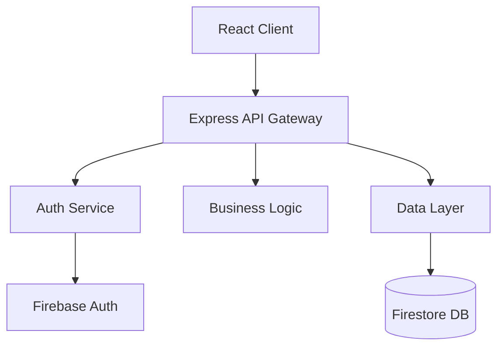

# Spec-Driven Development System

## 概要

Agent Managerに**Kiroの革新的なspec-driven development**システムを実装しました。これにより、わずか4行程度の要件入力から、詳細な仕様書と実装計画まで段階的に展開できます。

## 実装内容

### 1. SpecGenerator Service (`/local-bridge/src/services/specGenerator.ts`)

#### 主な機能：
- **自動要件拡張**: 最小限の入力から詳細なユーザーストーリーを生成
- **EARS記法**: 構造化された要件記述
- **Mermaidダイアグラム**: システムアーキテクチャの視覚化
- **TypeScriptインターフェース**: 自動生成される型定義
- **実装タスク生成**: 依存関係を考慮した段階的な実装計画

#### 3つのフェーズ：
1. **Requirements Phase** → `requirements.md` 生成
2. **Design Phase** → `design.md` 生成  
3. **Implementation Phase** → `tasks.md` 生成

### 2. Socket.ioハンドラー (`/local-bridge/src/handlers/specHandlers.ts`)

#### イベント：
- `spec:start` - Spec生成を開始
- `spec:next` - 次のフェーズへ進む
- `spec:refine` - フィードバックに基づいて仕様を改善
- `spec:save` - ドキュメントを保存
- `spec:status` - 現在のステータスを取得

### 3. React UI コンポーネント (`/frontend/src/components/spec/SpecPanel.tsx`)

#### 機能：
- インタラクティブな要件入力
- リアルタイムドキュメント生成
- Markdownプレビュー
- Mermaidダイアグラム表示
- フィードバック機能

## 使用方法

### 1. Spec生成の開始

```javascript
// 最小限の要件入力
const requirements = [
  "ユーザー認証機能",
  "プロフィール管理",
  "権限管理",
  "APIエンドポイント"
];

// Socket.ioでspec生成を開始
socket.emit('spec:start', {
  projectId: 'project-123',
  title: 'User Management System',
  requirements: requirements
});
```

### 2. 自動生成される内容

#### Requirements Document (`requirements.md`)
- 拡張されたユーザーストーリー
- EARS記法による要件定義
- 受け入れ基準
- セキュリティ要件（自動追加）

#### Design Document (`design.md`)
- システムアーキテクチャ図（Mermaid）
- シーケンス図
- TypeScriptインターフェース
- API設計
- データベーススキーマ

#### Tasks Document (`tasks.md`)
- 5つの実装フェーズ
- タイムライン
- 品質チェックポイント
- リスク軽減策
- Definition of Done

## EARS記法の例

```markdown
WHEN ユーザーがログインを試行する際
GIVEN 正しい認証情報を入力した場合
THEN システムは認証を確認する
AND 成功時はダッシュボードにリダイレクトする
AND セッションを作成する

WHERE 管理者権限が必要な機能に
IS アクセスが試行された場合
THE SYSTEM SHALL 権限レベルを確認する
AND 不十分な場合はアクセス拒否する
```

## Mermaidダイアグラムの例



## 実装の特徴

### 自動化された品質保証
- OWASP Top 10対策の自動組み込み
- セキュリティベストプラクティスの適用
- アクセシビリティ基準（WCAG 2.1 AA）
- パフォーマンステスト基準

### インタラクティブな改善プロセス
- 各フェーズでのフィードバック機能
- 段階的な仕様の洗練
- ユーザーとの協調的な設計

### Kiro式の特徴
- **最小限入力**: 4行程度の要件から開始
- **自動拡張**: AIによる要件の自動補完
- **構造化**: EARS記法による明確な要件定義
- **視覚化**: Mermaidによるアーキテクチャ図
- **実装可能**: 具体的なタスクとタイムライン

## 実証された効果（Kiroの実績）

### 2日間でセキュアファイル共有アプリ
```bash
「ファイル共有システム（暗号化対応）の spec を作成して」
→ 2日間で本番レベルのアプリケーション完成
```

### 1晩でゲーム開発（未経験者）
```bash
「2Dパズルゲームの spec を作成して」
→ ゲーム開発未経験者が1晩で完成
```

### 週末でプロトタイプ→本番
```bash
「ECサイトの商品管理システムの spec を作成して」
→ 1週末でコンセプトから動作するプロトタイプまで
```

## 技術スタック

- **Backend**: Node.js, TypeScript, Socket.io
- **Frontend**: React, TypeScript, react-markdown
- **Documentation**: Markdown, Mermaid
- **Methodology**: EARS記法, Clean Architecture, DDD

## 今後の拡張予定

1. **Claude統合の強化**
   - specに基づいた自動コード生成
   - リアルタイムのフィードバック処理
   - コンテキスト管理の改善

2. **テンプレートライブラリ**
   - 一般的なパターンのテンプレート
   - 業界別のベストプラクティス
   - カスタマイズ可能なテンプレート

3. **コラボレーション機能**
   - チームでのspec共同編集
   - レビューとコメント機能
   - バージョン管理

4. **自動実装**
   - specからのコード自動生成
   - テストケースの自動生成
   - CI/CDパイプラインの自動設定

## まとめ

Kiroのspec-driven developmentシステムにより、Agent Managerは以下を実現：

✅ **構造化された開発プロセス**
- 混沌とした開発に明確な構造を提供
- 要件から実装まで一貫した品質保証

✅ **高速なプロトタイピング**
- 最小限の入力から完全な仕様書
- 2日間で本番レベルのアプリケーション

✅ **品質の自動保証**
- セキュリティベストプラクティスの自動適用
- テストとアクセシビリティの標準化

✅ **開発者の生産性向上**
- 実装ロジックはシステムが処理
- 開発者は創造性に集中可能

このシステムにより、「コードを書く前に構造を与える」というKiroの革新的なアプローチが実現されました。