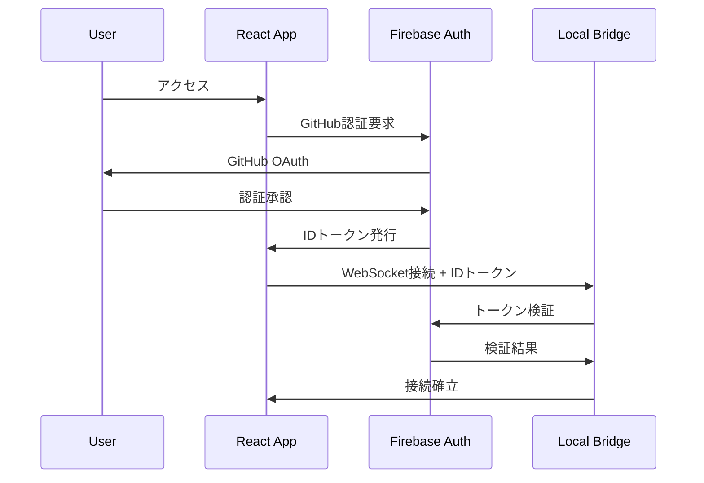
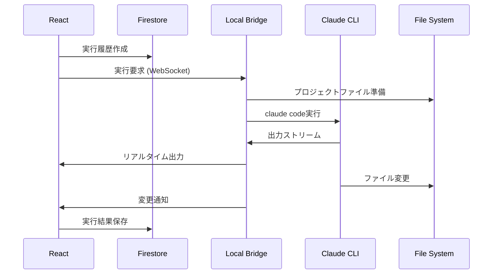

# Claude Code Manager - 詳細技術仕様書

## 1. システムアーキテクチャ詳細

### 1.1 全体構成

```
┌─────────────────────────────────────────────────────────────┐
│                     クライアント層                            │
│  ┌──────────────────────────────────────────────────────┐  │
│  │              React SPA (TypeScript)                   │  │
│  │  ┌────────────┬────────────┬────────────┬─────────┐ │  │
│  │  │   Auth     │   Editor   │   File    │ Execute │ │  │
│  │  │  Module    │   Module   │  Manager  │  Panel  │ │  │
│  │  └──────┬─────┴──────┬─────┴──────┬─────┴────┬────┘ │  │
│  │         └────────────┴────────────┴───────────┘      │  │
│  │                    State Management                   │  │
│  │                  (Context API / Zustand)             │  │
│  └──────────────────────────────────────────────────────┘  │
└─────────────────────────────────┬───────────────────────────┘
                                  │ HTTPS/WSS
┌─────────────────────────────────┴───────────────────────────┐
│                        Firebase層                            │
│  ┌──────────────┬──────────────┬──────────────┬─────────┐  │
│  │Authentication│  Firestore   │   Storage    │Functions│  │
│  │   (GitHub)   │  (NoSQL DB)  │ (File Store) │  (API)  │  │
│  └──────────────┴──────────────┴──────────────┴─────────┘  │
└─────────────────────────────────┬───────────────────────────┘
                                  │ WebSocket
┌─────────────────────────────────┴───────────────────────────┐
│                    ローカルブリッジ層                         │
│  ┌──────────────────────────────────────────────────────┐  │
│  │              Express + Socket.io Server               │  │
│  │  ┌────────────┬────────────┬────────────┬─────────┐ │  │
│  │  │   Auth     │  Session   │   Claude   │  File   │ │  │
│  │  │ Validator  │  Manager   │  Executor  │  Sync   │ │  │
│  │  └────────────┴────────────┴────────────┴─────────┘ │  │
│  └──────────────────────────────────────────────────────┘  │
└─────────────────────────────────────────────────────────────┘
```

### 1.2 データフロー

#### 1.2.1 認証フロー


#### 1.2.2 Claude実行フロー


## 2. コンポーネント詳細設計

### 2.1 フロントエンドコンポーネント構成

```typescript
// src/components/structure.ts
export const componentStructure = {
  layout: {
    AppLayout: 'アプリケーション全体のレイアウト',
    Header: 'ヘッダーコンポーネント',
    Sidebar: 'サイドバー（デスクトップ）',
    MobileNav: 'モバイルナビゲーション',
    ResponsiveContainer: 'レスポンシブコンテナ'
  },
  
  auth: {
    LoginPage: 'ログインページ',
    AuthProvider: '認証コンテキストプロバイダー',
    ProtectedRoute: '認証保護ルート',
    UserMenu: 'ユーザーメニュー'
  },
  
  project: {
    ProjectList: 'プロジェクト一覧',
    ProjectCard: 'プロジェクトカード',
    ProjectCreator: 'プロジェクト作成モーダル',
    ProjectSettings: 'プロジェクト設定'
  },
  
  editor: {
    MonacoEditor: 'Monaco Editorラッパー',
    EditorTabs: 'エディタータブ管理',
    EditorToolbar: 'エディターツールバー',
    MobileEditor: 'モバイル用エディター'
  },
  
  fileManager: {
    FileExplorer: 'ファイルエクスプローラー',
    FileTree: 'ファイルツリーコンポーネント',
    FileUploader: 'ファイルアップローダー',
    ContextMenu: 'コンテキストメニュー'
  },
  
  execution: {
    ExecutionPanel: '実行パネル',
    CommandInput: 'コマンド入力',
    OutputDisplay: '出力表示',
    ExecutionHistory: '実行履歴'
  },
  
  common: {
    LoadingSpinner: 'ローディング表示',
    ErrorBoundary: 'エラーバウンダリー',
    Toast: 'トースト通知',
    Modal: 'モーダルダイアログ'
  }
};
```

### 2.2 状態管理設計

```typescript
// src/store/types.ts
export interface AppState {
  auth: {
    user: User | null;
    isAuthenticated: boolean;
    loading: boolean;
  };
  
  project: {
    current: Project | null;
    list: Project[];
    loading: boolean;
  };
  
  files: {
    tree: FileNode[];
    openFiles: OpenFile[];
    activeFile: string | null;
    unsavedChanges: Map<string, string>;
  };
  
  execution: {
    isRunning: boolean;
    currentExecution: Execution | null;
    output: string[];
    history: Execution[];
  };
  
  ui: {
    sidebarOpen: boolean;
    theme: 'light' | 'dark';
    device: 'mobile' | 'tablet' | 'desktop';
  };
}

// src/store/actions.ts
export const actions = {
  auth: {
    login: () => Promise<void>,
    logout: () => Promise<void>,
    refreshToken: () => Promise<void>
  },
  
  project: {
    create: (data: ProjectData) => Promise<Project>,
    load: (projectId: string) => Promise<void>,
    update: (updates: Partial<Project>) => Promise<void>,
    delete: (projectId: string) => Promise<void>
  },
  
  files: {
    create: (path: string, content?: string) => Promise<void>,
    update: (path: string, content: string) => Promise<void>,
    delete: (path: string) => Promise<void>,
    rename: (oldPath: string, newPath: string) => Promise<void>,
    upload: (files: File[]) => Promise<void>
  },
  
  execution: {
    run: (command: string, options?: ExecutionOptions) => Promise<void>,
    stop: () => Promise<void>,
    clearOutput: () => void
  }
};
```

### 2.3 ルーティング設計

```typescript
// src/routes/config.ts
export const routes = {
  public: {
    login: '/login',
    about: '/about',
    docs: '/docs'
  },
  
  protected: {
    dashboard: '/',
    project: {
      list: '/projects',
      detail: '/projects/:projectId',
      settings: '/projects/:projectId/settings'
    },
    editor: '/projects/:projectId/editor',
    execution: '/projects/:projectId/execute',
    profile: '/profile',
    settings: '/settings'
  }
};

// レスポンシブルーティング
export const responsiveRoutes = {
  mobile: {
    '/projects/:projectId': {
      files: '/projects/:projectId/files',
      editor: '/projects/:projectId/editor',
      execute: '/projects/:projectId/execute'
    }
  },
  
  desktop: {
    '/projects/:projectId': '/projects/:projectId/workspace'
  }
};
```

## 3. バックエンド詳細設計

### 3.1 Firebase Functions API

```typescript
// functions/src/api/endpoints.ts
export const apiEndpoints = {
  // プロジェクト管理
  'POST /api/projects': 'プロジェクト作成',
  'GET /api/projects': 'プロジェクト一覧取得',
  'GET /api/projects/:id': 'プロジェクト詳細取得',
  'PUT /api/projects/:id': 'プロジェクト更新',
  'DELETE /api/projects/:id': 'プロジェクト削除',
  
  // ファイル管理
  'POST /api/projects/:id/files': 'ファイルアップロード',
  'GET /api/projects/:id/files': 'ファイル一覧取得',
  'GET /api/projects/:id/files/*': 'ファイル内容取得',
  'PUT /api/projects/:id/files/*': 'ファイル更新',
  'DELETE /api/projects/:id/files/*': 'ファイル削除',
  
  // 実行管理
  'GET /api/projects/:id/executions': '実行履歴取得',
  'GET /api/projects/:id/executions/:execId': '実行詳細取得',
  
  // ユーザー管理
  'GET /api/user/profile': 'プロフィール取得',
  'PUT /api/user/profile': 'プロフィール更新',
  'GET /api/user/usage': '使用状況取得'
};

// functions/src/middleware/auth.ts
export const authMiddleware = async (req: Request, res: Response, next: NextFunction) => {
  const token = req.headers.authorization?.split('Bearer ')[1];
  
  if (!token) {
    return res.status(401).json({ error: 'Unauthorized' });
  }
  
  try {
    const decodedToken = await admin.auth().verifyIdToken(token);
    req.user = decodedToken;
    next();
  } catch (error) {
    return res.status(401).json({ error: 'Invalid token' });
  }
};
```

### 3.2 Firestore データ構造詳細

```typescript
// Firestore Collection Schemas

// users/{userId}
interface UserDocument {
  userId: string;
  email: string;
  displayName: string;
  githubUsername: string;
  photoURL?: string;
  settings: {
    theme: 'light' | 'dark';
    editorConfig: {
      fontSize: number;
      tabSize: number;
      wordWrap: boolean;
    };
    notifications: {
      email: boolean;
      push: boolean;
    };
  };
  usage: {
    projectCount: number;
    totalExecutions: number;
    totalStorage: number; // bytes
  };
  subscription: {
    plan: 'free' | 'pro';
    expiresAt?: Timestamp;
  };
  createdAt: Timestamp;
  updatedAt: Timestamp;
}

// projects/{projectId}
interface ProjectDocument {
  projectId: string;
  userId: string;
  name: string;
  description: string;
  githubUrl?: string;
  isPublic: boolean;
  tags: string[];
  settings: {
    defaultCommand?: string;
    envVars?: Record<string, string>;
    workingDirectory: string;
  };
  stats: {
    fileCount: number;
    totalSize: number; // bytes
    lastExecutedAt?: Timestamp;
    executionCount: number;
  };
  collaborators: string[]; // user IDs (future feature)
  createdAt: Timestamp;
  updatedAt: Timestamp;
}

// projects/{projectId}/files/{fileId}
interface FileDocument {
  fileId: string;
  path: string;
  name: string;
  content: string;
  size: number;
  mimeType: string;
  encoding: string;
  isDirectory: boolean;
  permissions: {
    read: boolean;
    write: boolean;
    execute: boolean;
  };
  metadata: {
    language?: string;
    lineCount?: number;
    lastModifiedBy?: string;
  };
  createdAt: Timestamp;
  updatedAt: Timestamp;
}

// projects/{projectId}/executions/{executionId}
interface ExecutionDocument {
  executionId: string;
  command: string;
  status: 'pending' | 'running' | 'completed' | 'failed' | 'cancelled';
  output: string;
  error?: string;
  startedAt: Timestamp;
  completedAt?: Timestamp;
  duration?: number; // milliseconds
  filesChanged: {
    path: string;
    action: 'created' | 'modified' | 'deleted';
  }[];
  metadata: {
    triggerType: 'manual' | 'scheduled' | 'webhook';
    triggeredBy: string; // userId
    claudeModel?: string;
    tokenUsage?: {
      input: number;
      output: number;
    };
  };
}
```

### 3.3 Firebase Storage 構造

```
bucket/
├── users/
│   └── {userId}/
│       └── avatar.jpg
├── projects/
│   └── {projectId}/
│       ├── files/
│       │   └── {filepath}
│       └── backups/
│           └── {timestamp}/
│               └── {filepath}
└── temp/
    └── {sessionId}/
        └── uploads/
```

## 4. ローカルブリッジ詳細設計

### 4.1 サーバー構成

```typescript
// local-bridge/src/server.ts
import express from 'express';
import { Server as SocketIOServer } from 'socket.io';
import { createServer } from 'http';

export class LocalBridgeServer {
  private app: express.Application;
  private io: SocketIOServer;
  private sessions: Map<string, Session>;
  
  constructor() {
    this.app = express();
    const server = createServer(this.app);
    this.io = new SocketIOServer(server, {
      cors: {
        origin: process.env.ALLOWED_ORIGINS?.split(',') || ['http://localhost:3000'],
        credentials: true
      }
    });
    
    this.sessions = new Map();
    this.setupMiddleware();
    this.setupSocketHandlers();
  }
  
  private setupSocketHandlers() {
    this.io.on('connection', async (socket) => {
      // 認証
      const token = socket.handshake.auth.token;
      const user = await this.verifyToken(token);
      
      if (!user) {
        socket.disconnect();
        return;
      }
      
      // セッション作成
      const session = new Session(user, socket);
      this.sessions.set(socket.id, session);
      
      // イベントハンドラー
      socket.on('execute', (data) => this.handleExecute(session, data));
      socket.on('stop', () => this.handleStop(session));
      socket.on('file:sync', (data) => this.handleFileSync(session, data));
      
      socket.on('disconnect', () => {
        this.sessions.delete(socket.id);
        session.cleanup();
      });
    });
  }
}
```

### 4.2 Claude実行管理

```typescript
// local-bridge/src/claude-executor.ts
import { spawn, ChildProcess } from 'child_process';
import { EventEmitter } from 'events';

export class ClaudeExecutor extends EventEmitter {
  private process: ChildProcess | null = null;
  private outputBuffer: string[] = [];
  
  async execute(command: string, workingDir: string, options: ExecutionOptions) {
    if (this.process) {
      throw new Error('既に実行中です');
    }
    
    // 作業ディレクトリの準備
    await this.prepareWorkingDirectory(workingDir);
    
    // Claude CLIの実行
    this.process = spawn('claude', ['code'], {
      cwd: workingDir,
      env: {
        ...process.env,
        CLAUDE_API_KEY: options.apiKey
      }
    });
    
    // 標準入力にコマンドを送信
    this.process.stdin?.write(command + '\n');
    
    // 出力の処理
    this.process.stdout?.on('data', (data) => {
      const output = data.toString();
      this.outputBuffer.push(output);
      this.emit('output', output);
    });
    
    this.process.stderr?.on('data', (data) => {
      this.emit('error', data.toString());
    });
    
    this.process.on('close', (code) => {
      this.emit('complete', {
        code,
        output: this.outputBuffer.join(''),
        filesChanged: this.detectFileChanges(workingDir)
      });
      this.cleanup();
    });
  }
  
  stop() {
    if (this.process) {
      this.process.kill('SIGTERM');
      this.cleanup();
    }
  }
  
  private cleanup() {
    this.process = null;
    this.outputBuffer = [];
  }
}
```

### 4.3 ファイル同期システム

```typescript
// local-bridge/src/file-sync.ts
export class FileSync {
  private watcher: FSWatcher | null = null;
  
  async syncFromFirebase(projectId: string, localPath: string) {
    // Firebaseからファイルリストを取得
    const files = await this.getFirebaseFiles(projectId);
    
    // ローカルに同期
    for (const file of files) {
      const filePath = path.join(localPath, file.path);
      await fs.ensureDir(path.dirname(filePath));
      await fs.writeFile(filePath, file.content);
    }
  }
  
  async syncToFirebase(projectId: string, localPath: string) {
    // 変更されたファイルを検出
    const changes = await this.detectChanges(localPath);
    
    // Firebaseに同期
    for (const change of changes) {
      if (change.type === 'create' || change.type === 'modify') {
        const content = await fs.readFile(change.path, 'utf-8');
        await this.updateFirebaseFile(projectId, change.relativePath, content);
      } else if (change.type === 'delete') {
        await this.deleteFirebaseFile(projectId, change.relativePath);
      }
    }
  }
  
  watchDirectory(localPath: string, callback: (changes: FileChange[]) => void) {
    this.watcher = chokidar.watch(localPath, {
      ignored: /(^|[\/\\])\../, // 隠しファイルを無視
      persistent: true
    });
    
    const changes: FileChange[] = [];
    
    this.watcher
      .on('add', path => changes.push({ type: 'create', path }))
      .on('change', path => changes.push({ type: 'modify', path }))
      .on('unlink', path => changes.push({ type: 'delete', path }));
    
    // デバウンス処理
    const debouncedCallback = debounce(() => {
      if (changes.length > 0) {
        callback([...changes]);
        changes.length = 0;
      }
    }, 1000);
    
    this.watcher.on('all', debouncedCallback);
  }
}
```

## 5. セキュリティ設計

### 5.1 認証・認可

```typescript
// セキュリティポリシー
export const securityPolicies = {
  authentication: {
    provider: 'Firebase Auth (GitHub OAuth)',
    sessionDuration: '7 days',
    tokenRefresh: '1 hour',
    mfa: false // MVP版では無効
  },
  
  authorization: {
    projectAccess: 'owner-only', // MVP版では所有者のみ
    fileAccess: 'project-scoped',
    executionAccess: 'project-scoped'
  },
  
  rateLimit: {
    api: {
      authenticated: '1000 requests/hour',
      unauthenticated: '100 requests/hour'
    },
    execution: {
      concurrent: 1,
      daily: 100
    },
    storage: {
      fileSize: '10MB',
      projectSize: '1GB',
      totalUserStorage: '10GB'
    }
  }
};
```

### 5.2 データ保護

```typescript
// 暗号化設定
export const encryptionConfig = {
  // 保存時の暗号化
  atRest: {
    firestore: 'Google管理の暗号化',
    storage: 'Google管理の暗号化',
    localBridge: {
      tempFiles: 'AES-256-GCM',
      credentials: '環境変数（暗号化なし）'
    }
  },
  
  // 通信時の暗号化
  inTransit: {
    webApp: 'HTTPS (TLS 1.3)',
    websocket: 'WSS (TLS 1.3)',
    localBridge: 'localhost only (no encryption)'
  },
  
  // 機密情報の扱い
  sensitive: {
    apiKeys: '環境変数に保存、クライアントには送信しない',
    tokens: 'HTTPOnly Cookie + Secure flag',
    passwords: 'Firebase Auth管理（ハッシュ化）'
  }
};
```

### 5.3 入力検証

```typescript
// バリデーションルール
export const validationRules = {
  project: {
    name: {
      minLength: 1,
      maxLength: 100,
      pattern: /^[a-zA-Z0-9\s\-_]+$/,
      required: true
    },
    description: {
      maxLength: 500,
      required: false
    }
  },
  
  file: {
    path: {
      maxLength: 255,
      pattern: /^[a-zA-Z0-9\-_\/\.]+$/,
      forbidden: ['..', '~', '/etc', '/usr', '/bin']
    },
    content: {
      maxSize: 10 * 1024 * 1024, // 10MB
      encoding: ['utf-8', 'ascii']
    }
  },
  
  execution: {
    command: {
      maxLength: 1000,
      forbidden: ['rm -rf', 'sudo', 'chmod', 'chown']
    },
    timeout: {
      min: 1000,
      max: 300000, // 5分
      default: 60000 // 1分
    }
  }
};
```

## 6. パフォーマンス最適化

### 6.1 フロントエンド最適化

```typescript
// 最適化戦略
export const optimizationStrategies = {
  bundling: {
    // コード分割
    codeSplitting: {
      routes: true,
      components: ['MonacoEditor', 'FileExplorer'],
      threshold: 30000 // 30KB
    },
    
    // 遅延読み込み
    lazyLoading: {
      images: true,
      heavyComponents: true,
      routes: true
    },
    
    // Tree shaking
    treeShaking: {
      sideEffects: false,
      usedExports: true
    }
  },
  
  caching: {
    // Service Worker
    serviceWorker: {
      strategy: 'network-first',
      cacheDuration: '7 days',
      offlinePages: ['/offline', '/']
    },
    
    // ブラウザキャッシュ
    browserCache: {
      static: '1 year',
      api: 'no-cache',
      html: 'no-cache'
    }
  },
  
  rendering: {
    // React最適化
    react: {
      memo: true,
      useMemo: true,
      useCallback: true,
      virtualizing: ['FileList', 'ExecutionLog']
    }
  }
};
```

### 6.2 バックエンド最適化

```typescript
// Firestore最適化
export const firestoreOptimization = {
  // インデックス設計
  indexes: [
    {
      collection: 'projects',
      fields: ['userId', 'updatedAt'],
      order: 'DESCENDING'
    },
    {
      collection: 'executions',
      fields: ['projectId', 'startedAt'],
      order: 'DESCENDING'
    }
  ],
  
  // クエリ最適化
  queries: {
    pagination: {
      defaultLimit: 20,
      maxLimit: 100
    },
    projection: true, // 必要なフィールドのみ取得
    caching: {
      projects: '5 minutes',
      files: '1 minute'
    }
  },
  
  // バッチ処理
  batching: {
    writes: {
      maxSize: 500,
      maxOperations: 500
    }
  }
};
```

## 7. エラーハンドリング

### 7.1 エラー分類と対処

```typescript
// エラータイプ定義
export enum ErrorType {
  // 認証エラー
  AUTH_INVALID_TOKEN = 'AUTH_001',
  AUTH_SESSION_EXPIRED = 'AUTH_002',
  AUTH_PERMISSION_DENIED = 'AUTH_003',
  
  // プロジェクトエラー
  PROJECT_NOT_FOUND = 'PROJ_001',
  PROJECT_LIMIT_EXCEEDED = 'PROJ_002',
  PROJECT_INVALID_NAME = 'PROJ_003',
  
  // ファイルエラー
  FILE_NOT_FOUND = 'FILE_001',
  FILE_TOO_LARGE = 'FILE_002',
  FILE_INVALID_TYPE = 'FILE_003',
  
  // 実行エラー
  EXECUTION_TIMEOUT = 'EXEC_001',
  EXECUTION_FAILED = 'EXEC_002',
  EXECUTION_BRIDGE_DISCONNECTED = 'EXEC_003',
  
  // ネットワークエラー
  NETWORK_OFFLINE = 'NET_001',
  NETWORK_TIMEOUT = 'NET_002',
  NETWORK_SERVER_ERROR = 'NET_003'
}

// エラーハンドリング戦略
export const errorHandlingStrategies = {
  [ErrorType.AUTH_SESSION_EXPIRED]: {
    action: 'refresh-token',
    fallback: 'redirect-to-login',
    userMessage: 'セッションの有効期限が切れました。再度ログインしてください。'
  },
  
  [ErrorType.FILE_TOO_LARGE]: {
    action: 'show-error',
    userMessage: 'ファイルサイズが制限を超えています（最大10MB）。',
    suggestion: 'ファイルを分割するか、不要な部分を削除してください。'
  },
  
  [ErrorType.EXECUTION_BRIDGE_DISCONNECTED]: {
    action: 'reconnect',
    retries: 3,
    userMessage: 'ローカルブリッジとの接続が切断されました。',
    suggestion: 'ローカルブリッジが起動していることを確認してください。'
  }
};
```

### 7.2 エラー通知UI

```tsx
// src/components/ErrorNotification.tsx
export const ErrorNotification: React.FC<{ error: AppError }> = ({ error }) => {
  const strategy = errorHandlingStrategies[error.type];
  
  return (
    <div className={`
      fixed bottom-4 right-4 max-w-md p-4 rounded-lg shadow-lg
      ${error.severity === 'critical' ? 'bg-red-600' : 'bg-yellow-500'}
      text-white
    `}>
      <div className="flex items-start">
        <ExclamationIcon className="h-5 w-5 mr-2 flex-shrink-0" />
        <div>
          <h3 className="font-semibold">{strategy.userMessage}</h3>
          {strategy.suggestion && (
            <p className="mt-1 text-sm opacity-90">{strategy.suggestion}</p>
          )}
          {error.details && process.env.NODE_ENV === 'development' && (
            <details className="mt-2 text-xs">
              <summary>詳細情報</summary>
              <pre className="mt-1 overflow-auto">{JSON.stringify(error.details, null, 2)}</pre>
            </details>
          )}
        </div>
      </div>
    </div>
  );
};
```

## 8. テスト戦略

### 8.1 テストカバレッジ目標

```typescript
export const testCoverage = {
  unit: {
    target: 80,
    critical: 95, // 認証、データ処理など
    files: [
      'src/utils/**/*.ts',
      'src/hooks/**/*.ts',
      'src/store/**/*.ts'
    ]
  },
  
  integration: {
    target: 70,
    scenarios: [
      'ユーザー認証フロー',
      'プロジェクト作成・編集',
      'ファイル操作',
      'Claude実行'
    ]
  },
  
  e2e: {
    target: 60,
    criticalPaths: [
      'ログイン → プロジェクト作成 → ファイル編集 → 実行',
      'ファイルアップロード → 編集 → 保存',
      'Claude実行 → 結果確認 → ファイル変更確認'
    ]
  }
};
```

### 8.2 テスト実装例

```typescript
// src/__tests__/hooks/useAuth.test.ts
describe('useAuth Hook', () => {
  it('should handle login flow correctly', async () => {
    const { result } = renderHook(() => useAuth());
    
    act(() => {
      result.current.login();
    });
    
    expect(result.current.isLoading).toBe(true);
    
    await waitFor(() => {
      expect(result.current.isAuthenticated).toBe(true);
      expect(result.current.user).toBeDefined();
    });
  });
  
  it('should handle token refresh', async () => {
    // テスト実装
  });
});

// e2e/specs/project-workflow.spec.ts
describe('Project Workflow', () => {
  it('should complete full project workflow', async () => {
    // ログイン
    await page.goto('/login');
    await page.click('[data-testid="github-login"]');
    await page.waitForNavigation();
    
    // プロジェクト作成
    await page.click('[data-testid="create-project"]');
    await page.fill('[name="projectName"]', 'Test Project');
    await page.click('[type="submit"]');
    
    // ファイル作成
    await page.click('[data-testid="new-file"]');
    await page.fill('[name="fileName"]', 'test.js');
    await page.click('[data-testid="create-file"]');
    
    // コード編集
    await page.fill('[data-testid="editor"]', 'console.log("Hello");');
    await page.keyboard.press('Control+S');
    
    // Claude実行
    await page.fill('[data-testid="command-input"]', 'Add error handling');
    await page.click('[data-testid="run-claude"]');
    
    // 結果確認
    await page.waitForSelector('[data-testid="execution-complete"]');
    expect(await page.textContent('[data-testid="output"]')).toContain('completed');
  });
});
```

## 9. デプロイメント設計

### 9.1 環境構成

```yaml
# environments.yaml
environments:
  development:
    firebase:
      project: agent-manager-dev
      region: asia-northeast1
    frontend:
      url: http://localhost:3000
      api: http://localhost:5000
    localBridge:
      port: 8080
  
  staging:
    firebase:
      project: agent-manager-staging
      region: asia-northeast1
    frontend:
      url: https://staging.agent-manager.app
      api: https://api-staging.agent-manager.app
    localBridge:
      port: 8080
  
  production:
    firebase:
      project: agent-manager-prod
      region: asia-northeast1
    frontend:
      url: https://agent-manager.app
      api: https://api.agent-manager.app
    localBridge:
      port: 8080
```

### 9.2 CI/CD パイプライン

```yaml
# .github/workflows/deploy.yml
name: Deploy

on:
  push:
    branches: [main]
  pull_request:
    branches: [main]

jobs:
  test:
    runs-on: ubuntu-latest
    steps:
      - uses: actions/checkout@v3
      - uses: actions/setup-node@v3
        with:
          node-version: '18'
      
      - name: Install dependencies
        run: npm ci
      
      - name: Run tests
        run: |
          npm run test:unit
          npm run test:integration
      
      - name: Build
        run: npm run build

  deploy-staging:
    needs: test
    if: github.ref == 'refs/heads/main'
    runs-on: ubuntu-latest
    steps:
      - uses: actions/checkout@v3
      
      - name: Deploy to Firebase
        uses: w9jds/firebase-action@master
        with:
          args: deploy --only hosting,functions
        env:
          FIREBASE_TOKEN: ${{ secrets.FIREBASE_TOKEN }}
          PROJECT_ID: agent-manager-staging

  deploy-production:
    needs: deploy-staging
    if: github.ref == 'refs/heads/main'
    runs-on: ubuntu-latest
    environment: production
    steps:
      - uses: actions/checkout@v3
      
      - name: Deploy to Firebase
        uses: w9jds/firebase-action@master
        with:
          args: deploy --only hosting,functions
        env:
          FIREBASE_TOKEN: ${{ secrets.FIREBASE_TOKEN }}
          PROJECT_ID: agent-manager-prod
```

## 10. モニタリング設計

### 10.1 監視項目

```typescript
// monitoring/metrics.ts
export const monitoringMetrics = {
  performance: {
    // ページロード時間
    pageLoad: {
      target: '< 3s',
      critical: '> 5s'
    },
    
    // API レスポンスタイム
    apiResponse: {
      p50: '< 200ms',
      p95: '< 1s',
      p99: '< 2s'
    },
    
    // Claude実行時間
    executionTime: {
      average: '< 30s',
      timeout: '5m'
    }
  },
  
  reliability: {
    // アップタイム
    uptime: {
      target: '99.9%',
      measurement: 'monthly'
    },
    
    // エラー率
    errorRate: {
      target: '< 1%',
      critical: '> 5%'
    }
  },
  
  usage: {
    // アクティブユーザー
    activeUsers: {
      daily: true,
      weekly: true,
      monthly: true
    },
    
    // 実行回数
    executions: {
      daily: true,
      perUser: true,
      perProject: true
    },
    
    // ストレージ使用量
    storage: {
      total: true,
      perUser: true,
      growth: true
    }
  }
};
```

### 10.2 アラート設定

```typescript
// monitoring/alerts.ts
export const alertConfig = {
  channels: {
    email: ['admin@agent-manager.app'],
    slack: '#agent-manager-alerts',
    pagerDuty: 'critical-only'
  },
  
  rules: [
    {
      name: 'High Error Rate',
      condition: 'errorRate > 5%',
      duration: '5 minutes',
      severity: 'critical',
      channels: ['email', 'slack', 'pagerDuty']
    },
    {
      name: 'Slow API Response',
      condition: 'apiResponse.p95 > 2s',
      duration: '10 minutes',
      severity: 'warning',
      channels: ['slack']
    },
    {
      name: 'Storage Limit',
      condition: 'storage.usage > 80%',
      duration: 'immediate',
      severity: 'warning',
      channels: ['email']
    }
  ]
};
```

## 11. 今後の拡張計画

### 11.1 Phase 2 機能

```typescript
export const phase2Features = {
  collaboration: {
    sharedProjects: 'プロジェクト共有機能',
    realTimeEditing: 'リアルタイム共同編集',
    comments: 'コードコメント機能',
    permissions: '詳細な権限管理'
  },
  
  automation: {
    scheduledExecutions: 'スケジュール実行',
    webhooks: 'Webhook連携',
    cicdIntegration: 'CI/CD統合',
    templates: 'プロジェクトテンプレート'
  },
  
  advanced: {
    customCommands: 'カスタムコマンド定義',
    plugins: 'プラグインシステム',
    analytics: '詳細な分析機能',
    apiAccess: 'REST API公開'
  }
};
```

### 11.2 スケーラビリティ計画

```typescript
export const scalabilityPlan = {
  infrastructure: {
    cdn: 'CloudFlare導入',
    multiRegion: 'マルチリージョン対応',
    autoScaling: '自動スケーリング設定',
    loadBalancing: 'ロードバランサー導入'
  },
  
  database: {
    sharding: 'プロジェクトIDベースのシャーディング',
    caching: 'Redis導入',
    readReplicas: '読み取り専用レプリカ',
    archiving: '古いデータのアーカイブ'
  },
  
  performance: {
    edgeComputing: 'Edge Functions活用',
    webAssembly: '重い処理のWASM化',
    streaming: 'ストリーミングレスポンス',
    compression: '高度な圧縮アルゴリズム'
  }
};
```